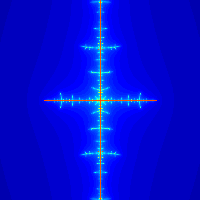

# Compression_DLR
##Aim
Allows compressing a time dependant function of matrices $A(t)\in\mathbb{R}^{m\times n},t\in [t_0,t_1]$. Compression is achieved using a dynamic low rank scheme. Matrices are either directly given in a discrete way as $(A_n)_{n\in \mathbb{N}}$ or indirectly as the solution of a matrix differential equation $\dot{A}(t)=F(A(t)),A(t_0)=A_0$ for some function $F$.  

##Background
Demos and implementation created for a university talk of 90 minutes. German slides can be obtained by request.
Based on paper *A projector-splitting integrator for dynamical low-rank approximation* from [Christian Lubich](https://na.uni-tuebingen.de/~lubich/) and [Ivan V. Oseledets](http://oseledets.github.io/people/oseledets/) published in Springer in 2013. ([Source](http://arxiv.org/pdf/1301.1058.pdf) from university network)

##Examples
Demo type fractal: original-bestapproximation-DLR with 33% data and 100 generations
   

Demo_GameOfLife: original-DLR with 33% data
  
##Implementation
Implementation is done in matlab, though the project core could be easily exported to python using numpy. 
Hint: For running the Demos you will need the ImageProcessingToolbox (v.9.3) to show the generated movies and frames.

The most important is the [DLR](Code/DLR.m) routine with its core being the [DLR_Step](Code/DLR_Step.m).
Uses a project splitting of order 1, this could be extended to projector splittings of higher order (for order 2 see paper). For this the DLR_Step would need to be adjusted.

The *DLR* routine and most *Demo* routines take parameters

+ approx: Some factor in $[0,2]$ controlling the compression, $0$ being maximum compression and $1$ no compression. Will set the approximation rank according to dimension of matrices. (default=0.33)
+ rank: Sets the approximation rank directly.(default=NotUsed)
+ fixed: If the approximation rank should remain fixed or change adaptively(default=true) .

This routine is used 
  1. in [DLR_Frames](Code/DLR_Frames.m) on a list of Frames that come from some generated movies or gif files.
  2. in [DLR_Heat_Integrator](Code/DLR_Heat_Integrator.m) to demonstrate the integration capability of the method by applying it to the inhomogenous heat equation with some arbitrary time and position dependend inhomogenity f. This resolves to the explicit euler method solving the stationary laplace problem using finite differences. Therefore, for accurate results, the starting condition and inhomgenitiy is required to be very smooth (4 times continously differentiable).

##Compression
The compression level is controlled by the rank parameter. The rank is either set directly over the *rank* parameter or indirectly over the *approx* parameter. Maximum compression is achieved for rank=1 (approx=0.), the minimum for the original rank which is at most the lower of both dimensions. 
For each matrix we obtain a factorization $A=USV^T$ (similar to singular value decomposition(SVD)). Here $U$ is is only a $r\times r$ matrix and $U$ is a $m \times r$ and $V$ a $n\times r$ matrix. We can assume $S$ to be diagonal (or else calculate SVD of this small matrix) and therefore required storage space is in $O((m+n+1)r)$.
This looks a lot like the classic SVD but the approach is different and has different intentions: 

+ We do not want to calculate the SVD of the big matrices $A$ for many time steps, we want to be fast
+ We want to use the fact that $A$ is differentiable in time
+ We want to be able to get an approximation from an implicit representation of $A$

This does **NOT** produce any official file format for the frames but only offers the matrices $U,S,V$ with $Frame=USV^T$. Potentially some regularization of $Frame$ is needed like: integer entries or positive entries only.

